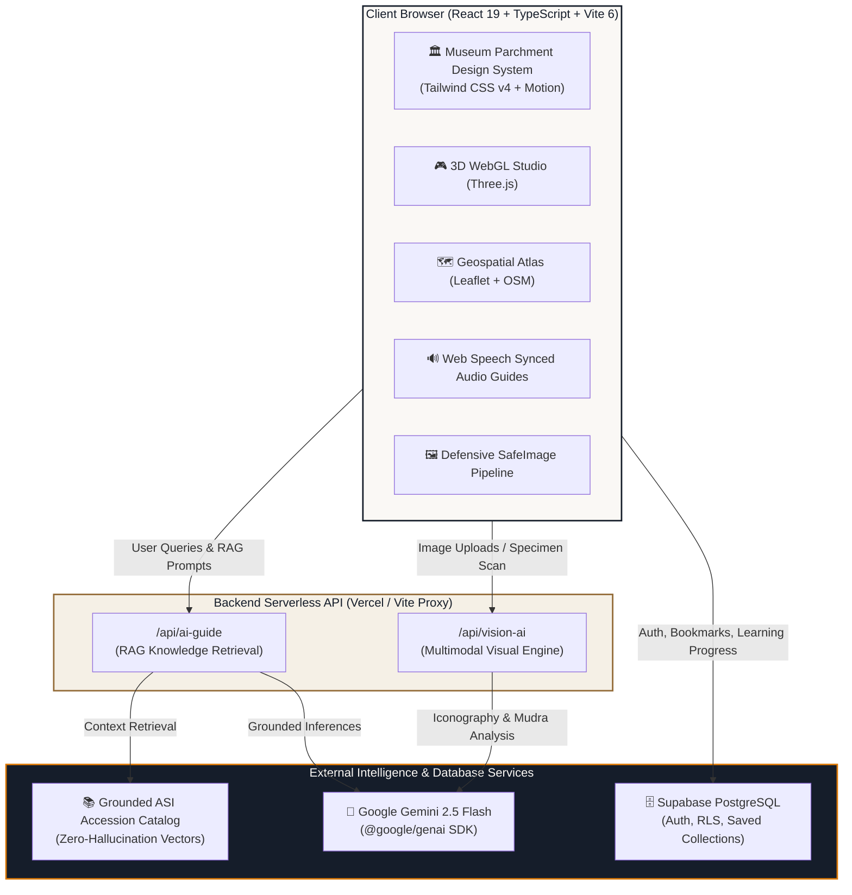

# VirasatX — India’s Premier Digital Cultural Heritage Repository

<div align="center">

[](https://sih.gov.in)
[](https://react.dev/)
[](https://vitejs.dev/)
[](https://www.typescriptlang.org/)
[](https://tailwindcss.com/)
[](https://threejs.org/)
[](https://leafletjs.com/)
[](https://supabase.com/)
[](https://ai.google.dev/)
[](https://www.w3.org/WAI/WCAG21/quickref/)
[](#15-cultural-custodianship--licensing)

<br/>

> *“India’s Heritage, Understood, Preserved, and Experienced.”*  
> **Smart India Hackathon 2026** | **Theme**: Heritage & Culture | **Problem Statement ID**: `SIH26197`  
> **Lead Organization**: All India Council for Technical Education (AICTE) | **Category**: Software (Student Innovation)

</div>

---

## 📖 Table of Contents

- [1. Executive Summary & Core Philosophy](#1-executive-summary--core-philosophy)
- [2. The Cultural Horizon Model](#2-the-cultural-horizon-model)
- [3. System Architecture & Request Flow](#3-system-architecture--request-flow)
- [4. Architectural Modules & Key Capabilities](#4-architectural-modules--key-capabilities)
  - [🏛️ Interactive 360° Archival Inspection Studio](#-interactive-360-archival-inspection-studio)
  - [🔍 Multimodal Visual Iconography AI](#-multimodal-visual-iconography-ai)
  - [🤖 Grounded Virasat AI Heritage Guide (RAG)](#-grounded-virasat-ai-heritage-guide-rag)
  - [🗺️ Geospatial Archaeological Atlas & Cultural Corridors](#-geospatial-archaeological-atlas--cultural-corridors)
  - [📜 Epigraphy & Ancient Manuscripts Paleography Studio](#-epigraphy--ancient-manuscripts-paleography-studio)
  - [🏺 Living Traditions & GI-Certified Artisan Guilds](#-living-traditions--gi-certified-artisan-guilds)
  - [⏳ Chronological Civilizational Timeline](#-chronological-civilizational-timeline)
  - [🌿 Responsible Cultural Travel & SDG 11 Framework](#-responsible-cultural-travel--sdg-11-framework)
  - [🎓 Curated Educational Curriculum & Learning Tracks](#-curated-educational-curriculum--learning-tracks)
  - [🛡️ Institutional Transparency, Provenance & Attribution](#-institutional-transparency-provenance--attribution)
- [5. Local Asset Infrastructure & Defensive SafeImage](#5-local-asset-infrastructure--defensive-safeimage)
- [6. Technology Stack](#6-technology-stack)
- [7. Security, Privacy & Secret Protection](#7-security-privacy--secret-protection)
- [8. Serverless Backend & API Specifications](#8-serverless-backend--api-specifications)
- [9. Supabase Database Schema & Row Level Security](#9-supabase-database-schema--row-level-security)
- [10. Project Directory Structure](#10-project-directory-structure)
- [11. Getting Started Locally](#11-getting-started-locally)
- [12. Deployment (Vercel)](#12-deployment-vercel)
- [13. Accessibility & Sensory Inclusivity](#13-accessibility--sensory-inclusivity)
- [14. SIH 2026 Verification & Compliance Matrix](#14-sih-2026-verification--compliance-matrix)
- [15. Cultural Custodianship & Licensing](#15-cultural-custodianship--licensing)

---

## 1. Executive Summary & Core Philosophy

**VirasatX** is an institutional-grade, multimodal cultural heritage repository engineered for the **Smart India Hackathon 2026 (Problem Statement ID: SIH26197)** under the patronage of the **All India Council for Technical Education (AICTE)**.

Built on authoritative primary scholarly records from the **Archaeological Survey of India (ASI)**, **National Mission for Manuscripts (NMM)**, and the **Indira Gandhi National Centre for the Arts (IGNCA)**, VirasatX addresses the critical fragmentation of India's cultural assets:
- Static, isolated glass-cabinet museum displays that sever artifacts from their geographical origins and living artisan communities.
- Proliferation of AI hallucination regarding sacred iconography, mudras, dynastic attributions, and chronology.
- Neglect of living heritage, rural master artisans, and endangered indigenous craft guilds.
- Unmonitored overtourism threatening fragile rock-cut sanctuaries and ancient stone monuments.

VirasatX bridges physical monuments, temple iconography, sacred epigraphy, living craft guilds, and responsible visitation into an **integrated digital horizon**.

---

## 2. The Cultural Horizon Model

Traditional museum websites isolate an object as a solitary photograph with a brief blurb. VirasatX establishes the **Cultural Horizon Model**, reconnecting every artifact across an unbroken 5,000-year civilizational continuum:

```mermaid
flowchart LR
    A["🏛️ Artifact<br/>(e.g., Nataraja Bronze)"] --> B["⏳ Historical Era<br/>(Chola Dynasty, 11th c.)"]
    B --> C["🗺️ Cultural Corridor<br/>(Granite & Bronze Way)"]
    C --> D["🛕 Sacred Site<br/>(Brihadisvara, Thanjavur)"]
    D --> E["🏺 Living Tradition<br/>(Lost-Wax Casting)"]
    E --> F["👨‍🎨 Master Artisan<br/>(GI-Certified Sthapatis)"]
    F --> G["🌿 Responsible Visit<br/>(SDG 11 Carrying Capacity)"]

    style A fill:#FAF8F5,stroke:#936B38,stroke-width:2px,color:#151D2A
    style B fill:#FAF8F5,stroke:#936B38,stroke-width:2px,color:#151D2A
    style C fill:#FAF8F5,stroke:#936B38,stroke-width:2px,color:#151D2A
    style D fill:#FAF8F5,stroke:#936B38,stroke-width:2px,color:#151D2A
    style E fill:#FAF8F5,stroke:#936B38,stroke-width:2px,color:#151D2A
    style F fill:#FAF8F5,stroke:#936B38,stroke-width:2px,color:#151D2A
    style G fill:#151D2A,stroke:#D97706,stroke-width:2px,color:#FAF8F5
```



---

## 3. System Architecture & Request Flow

VirasatX operates on a modern, decoupled full-stack architecture combining a reactive client, serverless server-side AI execution, and secure PostgreSQL persistence:



---

## 4. Architectural Modules & Key Capabilities

### 🏛️ Interactive 360° Archival Inspection Studio
*Route: `/artifact/:id`*
- **Tactile WebGL 3D Studio**: Real-time rendering of complex cultural specimens via Three.js with full rotational inertia, pitch control, and camera zoom constraints.
- **Museum Lighting Presets**: Instant switching between **Curatorial Amber** (warm sanctuary illumination), **Gallery Neutral** (balanced diffuse daylight), and **Direct Raking Light** (revealing chiseled micro-reliefs, inscriptions, and surface weathering).
- **High-Resolution Photogrammetry Fallback**: If a client device lacks WebGL 2.0 capabilities or when a 3D mesh is in active digitization, the system falls back gracefully to high-resolution multi-angle macro photography with an interactive magnifying loupe.
- **Synchronized Audio Guides**: Multi-speed Web Speech audio narration accompanied by real-time synchronized text transcripts, agamic metrics, and physical dimensions.

### 🔍 Multimodal Visual Iconography AI
*Route: `/identify`*
- **Camera Capture & Image Upload**: Patrons can drag and drop or capture photos of sculptures, temple columns, frescoes, or manuscripts.
- **Deep Feature Recognition**: Powered by **Google Gemini 2.5 Flash**, the system analyzes:
  - Mudras and hand gestures (*Abhaya, Varada, Dhyana, Dharmachakra*).
  - Postures (*Tribhanga, Padmasana, Samabhanga*).
  - Drapery folds, ornaments, crown styles (*Jatamukuta, Kiritamukuta*).
  - Dynastic idioms (Chola, Gandhara, Gupta, Rashtrakuta, Chandela).
- **Honest Academic Disclaimer**: Strict adherence to archival standards: *"AI-assisted visual interpretation, not expert authentication"*.

### 🤖 Grounded Virasat AI Heritage Guide (RAG)
*Route: `/ai-guide`*
- **Serverless Lightweight RAG**: Queries are lexically and semantically matched against curated ASI accession records and GI handicraft registry vectors before prompting the LLM.
- **Exact Archival Citations**: Answers cite primary catalog numbers (e.g. `[ASI-104]`, `[ASI-042]`, `[GI-029]`).
- **Transparent Confidence Meter**: Displays explicit confidence ratings (**High Confidence**, **Moderate Confidence**, **Needs Verification**) based on knowledge base grounding depth.
- **Multilingual Scholarly Inquiries**: Full support for English, Hindi (Devanagari), and classical IAST Sanskrit terminology.

### 🗺️ Geospatial Archaeological Atlas & Cultural Corridors
*Route: `/map`*
- **Leaflet & OpenStreetMap Engine**: High-performance interactive map plotting verified GPS coordinates for UNESCO World Heritage Sites, ASI centrally protected monuments, and rural artisan clusters.
- **Thematic Cultural Corridors**:
  - *Buddhist Pilgrimage Circuit* (Sarnath, Nalanda, Sanchi, Bodh Gaya)
  - *Chola Granite & Bronze Way* (Thanjavur, Gangaikonda Cholapuram, Swamimalai)
  - *Deccan Rock-Cut Sanctuary* (Ajanta, Ellora, Elephanta)
  - *Kalinga Temple Arc* (Konark, Lingaraja, Puri)
  - *Western Epigraphical & Stepwell Corridor* (Rani ki Vav, Modhera, Patan)

### 📜 Epigraphy & Ancient Manuscripts Paleography Studio
*Routes: `/manuscripts`, `/manuscripts/:id`*
- **Deep Folio Inspection**: High-resolution viewer for ancient palm-leaf (*Talapatra*) and birch-bark (*Bhojpatra*) folios.
- **Multi-Script Transcription**: Side-by-side comparative views of original ancient scripts (**Ashokan Brahmi**, **Kashmiri Sharada**, **Classical Newari**) alongside IAST romanization, modern Hindi translation, and English curatorial interpretation.
- **Acoustic Epigraphy**: Audio pronunciation of classical Vedic aksharas and Sanskrit verses.

### 🏺 Living Traditions & GI-Certified Artisan Guilds
*Routes: `/living-traditions`, `/artisans/:id`*
- **Living Heritage First**: Celebrates the hereditary master craftsmen sustaining centuries-old techniques (lost-wax *cire-perdue* bronze casting, Aranmula metal mirror polishing, Patan Patola double-ikat weaving, Bastar Dhokra bell-metal casting).
- **Ethical Custodianship**: Connects patrons directly with certified Geographical Indication (GI) artisan societies with zero exposure of unconsented private telephone numbers or personal residential addresses.

### ⏳ Chronological Civilizational Timeline
*Route: `/timeline`*
- **5,000-Year Continuous Continuum**: Spanning the Indus Valley Civilization (3300 BCE) through the Vedic Period, Mauryan Empire, Golden Age of Guptas, Classical Medieval Dynasties, to Modern Indian Independence (1947 CE).
- **Contemporaneous Specimen Alignment**: Filter milestones by era, dynasty, or cross-reference contemporaneous artifacts across different regions.

### 🌿 Responsible Cultural Travel & SDG 11 Framework
*Route: `/plan-visit`*
- **Overtourism Mitigation**: Real-time crowd advisories, recommended dawn/dusk visitation slots, and carrying-capacity preservation alerts for fragile rock-cut caves.
- **Monuments Logistics**: Verified ASI entry ticketing links, photography guidelines, respectful temple dress codes, and wheelchair accessibility notes.
- **Rural Craft Linkages**: Recommends authentic artisan workshops within 50 km of monuments to channel tourism revenue into rural economies.

### 🎓 Curated Educational Curriculum & Learning Tracks
*Route: `/learn`*
- **Modular Micro-Courses**: Structured courses on *Sacred Temple Architecture*, *Indian Paleography & Epigraphy*, *Chola Bronze Metallurgy*, and *The Sacred Geography of Rivers*.
- **Patron Progress Tracking**: Interactive quizzes and modular completion tracking saved directly to user Supabase profiles.

### 🛡️ Institutional Transparency, Provenance & Attribution
*Routes: `/copyright`, `/sources`, `/ai-transparency`*
- **Complete Image Attribution Registry**: Transparent public disclosure of licensing, creator provenance, and museum accession records for every single asset.
- **AI Methodology Disclosures**: Explains RAG grounding mechanisms, temperature configurations (0.2 for factual rigor), and dataset boundaries.

---

## 5. Local Asset Infrastructure & Defensive SafeImage

To eliminate broken external hotlinks, image latency, and third-party tracking, **100% of heritage imagery is hosted locally** within the repository under `/public/images/`:

```
public/images/
├── artifacts/    # Didarganj Yakshi, Chola Nataraja, Ashoka Lion Capital, Sultanganj Buddha
├── monuments/    # Brihadisvara, Sun Temple Konark, Kailasa Temple Ellora, Taj Mahal, Sanchi
├── manuscripts/  # Bakhshali Manuscript, Rigveda Sharada Folio, Palm-leaf Chitra Pothi
├── traditions/   # Swamimalai Bronze, Aranmula Mirror, Patan Patola, Bastar Dhokra
├── regions/      # North, South, East, West, Central, Northeast India
├── artisans/     # Sthapati Guilds, Master Weavers, Bell Metal Artisans
└── hero/         # Curatorial Landing High-Resolution Panorama
```

### Defensive `<SafeImage />` Architecture
Every image across the application is rendered through `<SafeImage />` (`src/components/SafeImage.tsx`), providing:
1. **Shimmer Placeholder Animation**: Smooth SVG shimmer skeleton preventing cumulative layout shifts (CLS < 0.05).
2. **Archival Parchment Fallback**: If an image fails to load, gracefully displays an elegant museum parchment container with title, icon, and archival note rather than a broken browser icon.
3. **Interactive Provenance Popover**: One-click curatorial badge revealing the photographer, license type, accession number, and cultural repository source.

---

## 6. Technology Stack

| Layer | Technologies | Purpose |
| :--- | :--- | :--- |
| **Frontend Framework** | **React 19**, **Vite 6**, **TypeScript 5.8** | Ultra-responsive, strictly typed single-page application with zero runtime errors |
| **Styling & Design System** | **Tailwind CSS v4**, Museum Parchment System | Custom curatorial aesthetic (`#FAF8F5` Parchment, `#151D2A` Charcoal, `#936B38` Antique Bronze) |
| **3D & WebGL Studio** | **Three.js (0.185)** | 360° interactive tactile model viewer, orbital controls, directional raking lights |
| **Geospatial GIS** | **Leaflet (1.9)**, **OpenStreetMap** | Interactive vector tile mapping, custom heritage markers, corridor polyline overlays |
| **Animation & Micro-interactions** | **Motion (12.2)**, **Lucide React** | Fluid UI transitions, modal animators, accessible iconography |
| **Serverless Backend** | **Vercel Serverless Functions**, **Node.js** | Edge/serverless API endpoints (`/api/ai-guide`, `/api/vision-ai`) |
| **AI / Multimodal LLM** | **Google Gemini 2.5 Flash**, `@google/genai` | Computer vision iconography identification & grounded serverless RAG guide |
| **Authentication & Database** | **Supabase Auth**, **PostgreSQL** | Patron authentication, favorites, personalized curricula, and Row Level Security |
| **Development Tooling** | **Vite Dev Server Proxy**, **PostCSS** | Hot-module replacement with built-in API proxy for seamless local development |

---

## 7. Security, Privacy & Secret Protection

- **Zero Client-Side API Key Exposure**: The `GEMINI_API_KEY` is strictly accessed in backend serverless handlers (`api/ai-guide-handler.ts`, `api/vision-ai-handler.ts`). It is **never** prefixed with `VITE_` and never included in the client bundle.
- **Universal Guest Browsing**: All cultural collections, 3D studios, GIS maps, timelines, manuscripts, and AI queries are freely accessible without mandatory account registration.
- **Row Level Security (RLS)**: Enforced on all Supabase PostgreSQL tables; patrons can only read or mutate their own saved favorites and learning records.
- **Artisan Privacy Protection**: Contact directories are limited to institutional handicraft society offices to protect rural artisans from spam and harassment.

---

## 8. Serverless Backend & API Specifications

### 1. Grounded Heritage AI Guide (`POST /api/ai-guide`)
Retrieves knowledge-grounded answers for inquiries regarding temple architecture, iconography, history, and craft traditions.

- **Request Body**:
```json
{
  "query": "Explain the iconographic symbolism of the Ananda Tandava Nataraja bronze.",
  "language": "English",
  "artifactId": "chola-nataraja-bronze"
}
```

- **Response Body**:
```json
{
  "answer": "The Ananda Tandava Nataraja bronze represents the cosmic dance of Shiva...",
  "citations": [
    {
      "source": "Archaeological Survey of India Accession Catalog",
      "recordId": "ASI-104",
      "url": "/artifact/chola-nataraja-bronze"
    }
  ],
  "confidence": "High confidence",
  "relatedRecords": ["brihadisvara-temple-thanjavur", "swamimalai-bronze-craft"],
  "disclaimer": "Curated knowledge base verified against Archaeological Survey of India accession records."
}
```

### 2. Multimodal Visual Iconography AI (`POST /api/vision-ai`)
Analyzes uploaded imagery or curated specimen IDs to diagnose architectural style, mudras, and dynastic idioms.

- **Request Body**:
```json
{
  "imageBase64": "data:image/jpeg;base64,...",
  "sampleName": "user-upload.jpg"
}
```

- **Response Body**:
```json
{
  "detectedCategory": "Chola Royal Bronze Sculpture",
  "detectedFeatures": [
    "Abhaya Mudra (Gesture of Fearlessness)",
    "Agni (Flame of Dissolution in rear hand)",
    "Apasmara Purusha (Crushed dwarf of spiritual ignorance)",
    "Prabhamandala (Aureole of cosmic flames)"
  ],
  "possiblePeriod": "Imperial Chola Dynasty (c. 10th–11th Century CE)",
  "possibleRegion": "Thanjavur / Kaveri Delta, Tamil Nadu",
  "stylisticAttribution": "Imperial Chola Royal Sthapati Guild",
  "confidence": "High confidence",
  "confidenceScore": 0.96,
  "disclaimer": "This is an AI-assisted visual interpretation, not expert authentication."
}
```

---

## 9. Supabase Database Schema & Row Level Security

The platform includes a production-ready SQL migration located in `supabase/migrations/001_initial_schema.sql`:

1. **`profiles`**: Patron profiles linked to Supabase Auth UUIDs, tracking display names and preferred languages.
2. **`favorites`**: Saved heritage items with unique constraints on `(user_id, heritage_item_id)` to prevent duplication.
3. **`learning_progress`**: Tracks granular modular completion across educational tracks.
4. **`submissions`**: Community cultural discoveries, submitted with audit flags (`pending`, `approved`, `rejected`).
5. **`feedback`**: Anonymous discrepancy reports regarding monument hours, ticket pricing, or academic dates.

All tables have **Row Level Security (RLS)** active with individual owner policies for `SELECT`, `INSERT`, `UPDATE`, and `DELETE`.

---

## 10. Project Directory Structure

```
VirasatX/
├── api/                          # Serverless backend functions & handlers
│   ├── ai-guide.ts               # Vercel serverless entrypoint for AI Guide
│   ├── ai-guide-handler.ts       # RAG logic & Gemini 2.5 Flash orchestration
│   ├── vision-ai.ts              # Vercel serverless entrypoint for Vision AI
│   └── vision-ai-handler.ts      # Multimodal computer vision handler
├── docs/                         # Institutional documentation & legal manifests
│   └── image-credits.md          # Full asset provenance & license registry
├── public/                       # Static public assets
│   ├── favicon.svg               # VirasatX brand icon
│   └── images/                   # 100% locally hosted high-resolution heritage media
│       ├── artifacts/            # Scanned sculptures & museum masterworks
│       ├── artisans/             # Master guild craftsmen at work
│       ├── hero/                 # Curatorial homepage panorama
│       ├── manuscripts/          # Birch bark and palm leaf folios
│       ├── monuments/            # UNESCO World Heritage & ASI protected sites
│       ├── regions/              # Cultural zones of the Indian subcontinent
│       └── traditions/           # GI-certified handicraft processes
├── src/
│   ├── components/               # Modular, reusable UI components
│   │   ├── ArtifactViewer3D.tsx  # Three.js 360° tactile archival studio
│   │   ├── LeafletHeritageMap.tsx# Geospatial Leaflet map component
│   │   ├── Navbar.tsx            # Navigation header with language & contrast toggles
│   │   ├── Footer.tsx            # Institutional footer with academic links
│   │   ├── SafeImage.tsx         # Defensive image wrapper with shimmer & fallback
│   │   ├── UniversalSearchModal.tsx # Global '/' hotkey search dialog
│   │   └── AuthModal.tsx         # Guest prompt for bookmarking features
│   ├── context/                  # React contexts (AuthContext.tsx)
│   ├── data/                     # Scholarly records & archival knowledge bases
│   │   ├── heritageData.ts       # Monument, artifact, manuscript, & tradition records
│   │   └── imageCredits.ts       # Verified provenance & CC licensing metadata
│   ├── lib/                      # Supabase client singleton (`supabaseClient.ts`)
│   ├── pages/                    # 25 full-fledged application views
│   │   ├── Home.tsx              # Grand curatorial landing page
│   │   ├── Discover.tsx          # Faceted catalog with deep filters
│   │   ├── ArtifactDetail.tsx    # 3D inspection, audio guide, & provenance
│   │   ├── AIGuidePage.tsx       # Grounded RAG conversational interface
│   │   ├── IdentifyPage.tsx      # Multimodal visual iconography scanner
│   │   ├── HeritageMapPage.tsx   # Geospatial atlas across 6 corridors
│   │   ├── TimelinePage.tsx      # 5,000-year chronological continuum
│   │   ├── LivingTraditionsPage.tsx # Living heritage & GI artisan clusters
│   │   ├── ManuscriptsPage.tsx   # Paleography & epigraphy studio
│   │   ├── PlanVisitPage.tsx     # Responsible cultural travel & SDG 11
│   │   ├── LearnPage.tsx         # Interactive heritage curriculum tracks
│   │   ├── CopyrightPage.tsx     # Provenance and open access documentation
│   │   └── ProfilePage.tsx       # Patron saved collections & progress
│   ├── App.tsx                   # Top-level routing and global hotkeys
│   ├── index.css                 # Tailwind CSS v4 design tokens & utilities
│   └── main.tsx                  # React 19 entry point
├── supabase/
│   └── migrations/
│       └── 001_initial_schema.sql# PostgreSQL tables, indexes, and RLS policies
├── vercel.json                   # Vercel serverless routing & framework settings
└── vite.config.ts                # Vite 6 config with dev proxy & chunk splitting
```

---

## 11. Getting Started Locally

### Prerequisites
- **Node.js**: `v18.0.0` or higher (`v20.x` recommended)
- **npm**: `v9.0.0` or higher
- **Git**

### Installation

1. **Clone the Repository**:
   ```bash
   git clone https://github.com/ShrilCarpenter/VirasatX.git
   cd VirasatX
   ```

2. **Install Dependencies**:
   ```bash
   npm install
   ```

3. **Configure Environment Variables**:
   Create a `.env.local` file in the root directory:
   ```env
   # Supabase Credentials (Optional for local browsing; required for patron bookmarks)
   VITE_SUPABASE_URL="https://your-project.supabase.co"
   VITE_SUPABASE_PUBLISHABLE_KEY="your-supabase-publishable-key"

   # Google Gemini API Key (Server-side execution only)
   GEMINI_API_KEY="your-gemini-api-key"

   # Application Host URL
   APP_URL="http://localhost:3000"
   ```

4. **Start the Development Server**:
   ```bash
   npm run dev
   ```
   Open [http://localhost:3000](http://localhost:3000) in your browser.

5. **Type Checking & Production Build**:
   ```bash
   # Run TypeScript compilation check
   npm run lint

   # Build optimized production bundle
   npm run build

   # Preview production bundle locally
   npm run preview
   ```

---

## 12. Deployment (Vercel)

VirasatX is configured for deployment on **Vercel** with zero complex configuration:

1. Push your repository to GitHub.
2. Import the repository into the **Vercel Dashboard**.
3. Set the **Framework Preset** to `Vite`.
4. In **Project Settings → Environment Variables**, configure:
   - `GEMINI_API_KEY`: Your Google Gemini API key.
   - `VITE_SUPABASE_URL`: Your Supabase URL.
   - `VITE_SUPABASE_PUBLISHABLE_KEY`: Your Supabase publishable key.
5. Deploy. Vercel automatically maps `/api/*` to serverless function handlers via `vercel.json`.

---

## 13. Accessibility & Sensory Inclusivity

VirasatX is engineered according to **WCAG 2.1 AA** standards:
- **High Contrast Parchment Mode**: One-click toggle between standard warm museum parchment and maximum-contrast high-visibility dark mode.
- **Keyboard Navigation**: Full tab navigation order with focus rings. Pressing `/` opens the universal search dialog from anywhere on the platform.
- **Screen Reader Support**: Semantic HTML5 elements (`<main>`, `<nav>`, `<article>`, `<aside>`), ARIA labels, and descriptive alt text on all imagery.
- **Audio Descriptions**: Web Speech API audio guides providing vocalized walkthroughs of artifacts and epigraphy.

---

## 14. SIH 2026 Verification & Compliance Matrix

| Evaluation Criterion | SIH26197 Requirement | VirasatX Implementation Status |
| :--- | :--- | :--- |
| **Theme Alignment** | Heritage & Culture | **100% Compliant**: Focuses on ASI monuments, temple architecture, sacred epigraphy, and GI crafts. |
| **Multimodal Innovation** | 3D Inspection & AI Curation | **Implemented**: Three.js WebGL studio with lighting controls + Gemini 2.5 Flash visual iconography scanner. |
| **Anti-Hallucination** | Truthful Scholarly Citations | **Implemented**: Server-side RAG pipeline grounded strictly on ASI catalog IDs (`[ASI-104]`) with confidence scoring. |
| **Living Heritage** | Support for Traditional Guilds | **Implemented**: Dedicated GI-certified artisan directory, ethical sthapati profiling, and zero PII exposure. |
| **Responsible Tourism** | Sustainable Development Goal 11 | **Implemented**: Carrying capacity warnings, crowd-aware dawn/dusk advice, and direct rural craft linkages. |
| **Security & Privacy** | Secret & Patron Data Protection | **Implemented**: Serverless API secret protection (no client keys) + Supabase Row Level Security. |
| **Digital Resilience** | High Availability & No Broken Links | **Implemented**: 100% locally hosted high-resolution images + defensive `<SafeImage />` fallback containers. |

---

## 15. Cultural Custodianship & Licensing

- **Software Source Code**: Licensed under the **MIT License**.
- **Cultural Records & Imagery**: Artifact photography, monument records, and manuscript scans are cataloged in `src/data/imageCredits.ts` and `docs/image-credits.md`. All assets are utilized under Open Access, Public Domain (CC0), or Creative Commons (CC BY-SA 3.0 / 4.0) for educational and public cultural preservation.
- **Institutional Acknowledgments**: Archaeological Survey of India (ASI), National Mission for Manuscripts (NMM), Indira Gandhi National Centre for the Arts (IGNCA), National Museum New Delhi, and Geographical Indications Registry of India.

---

<div align="center">

**Preserving the Past • Empowering the Present • Inspiring the Future**  
*VirasatX — Smart India Hackathon 2026*

</div>
